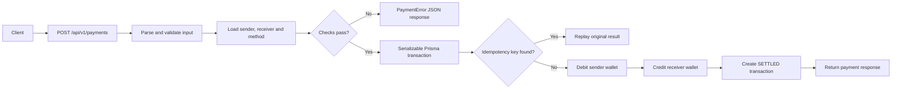
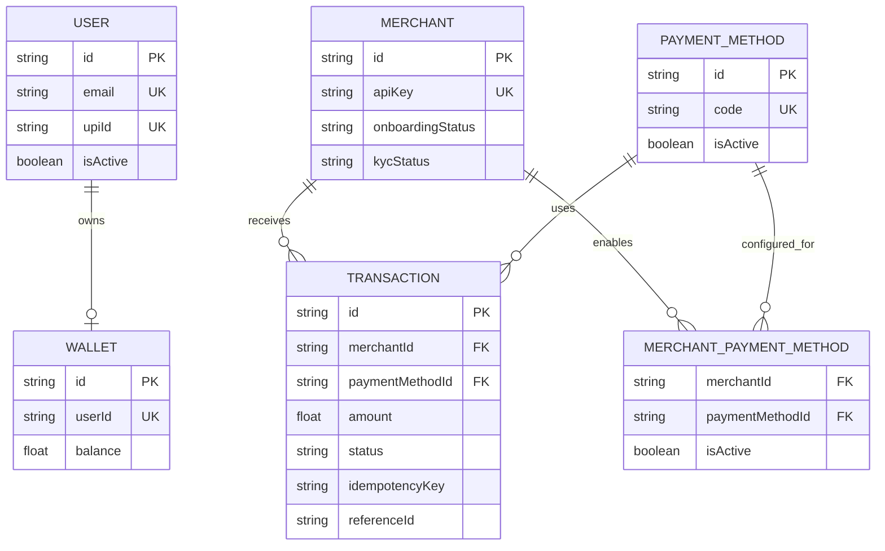

# NexaPay Architecture

> A small, transaction-safe wallet payment API built with Next.js, TypeScript, Prisma and PostgreSQL.

## At A Glance

| Layer | Responsibility |
| --- | --- |
| API | Accept requests and return consistent JSON responses |
| Payments | Validate, transfer wallet funds, and build the payment result |
| Persistence | Prisma repositories and serializable database transactions |
| Events | Publish transaction events and collect notifications |
| Data | Users, wallets, merchants, payment methods and transactions |

## Modules

### Payments (implemented)
**Submodules:** service, Prisma store, payment types.

- `createPaymentService` - orchestrates the payment use case
- `createPrismaPaymentStore` - adapts Prisma to the service interfaces
- `PaymentError` - carries an HTTP status and safe message
- Supports UPI and CARD wallet payments

### Transactions (implemented)
**Submodule:** state machine.

- `validTransition` - checks whether a state change is allowed
- `transition` - applies a valid change or throws
- States include `PENDING`, `PROCESSING`, `AUTHORIZED`, `CAPTURED`, `SETTLED`, `FAILED`, refunds and disputes

### Events (implemented)
**Submodules:** publisher, notification handler.

- `publish` - creates and emits a versioned transaction event
- `subscribe` - registers and removes event listeners
- `initializeNotificationHandler` - listens for transaction events
- `getNotifications` / `clearNotifications` - inspect test/demo notifications

### Merchants, Validation & Concurrency (extension points)
The folders exist for future merchant workflows, reusable validation, and explicit locking. Current payment validation and concurrency control live in the payment service and Prisma transaction boundary.

## Supporting Functions

Inside the payment service, small helpers handle the details:

- Input parsing and normalization: `parsePaymentInput`, `asNumber`, `asPaymentMethod`
- Payment checks: `validateCardDetails`, `passesLuhn`, `isValidUpiId`, `isCardExpired`
- Money and identity: `toPaise`, `fromPaise`, `normalizeIdempotencyKey`, `createReferenceId`
- Replay response: `buildPaymentResponseFromTransaction`

## API Surface

| Method | Endpoint | Purpose |
| --- | --- | --- |
| `POST` | `/api/v1/payments` | Process a UPI or card wallet payment |
| `POST` | `/api/v1/transactions` | Create a pending transaction directly |
| `GET` | `/api/v1/users/:userId` | Read a user's profile and balance |
| `GET` | `/api/v1/users/:userId/transactions` | Read recent sent/received history |

## Payment Flow



**Important guarantees:** amounts are converted to paise, duplicate requests can replay safely, and wallet updates plus transaction creation commit or roll back together.

## Data Model



## Schematic Summary

```text
Client
  -> Next.js API route
  -> Payment service
  -> Validation + idempotency checks
  -> Serializable Prisma transaction
	   -> sender wallet (-amount)
	   -> receiver wallet (+amount)
	   -> transaction record (SETTLED)
  -> JSON response

Transaction events -> EventEmitter -> Notification handler
```